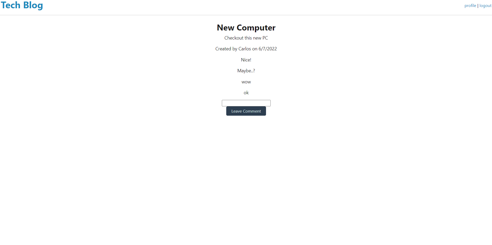

# TECH_Talk_w14

## Table of contents

- [General info](#general-info)
- [Screenshots](#screenshots)
- [Licenses](#technologies)
- [Setup](#setup)
- [Status](#status)
- [Contact](#contact)

## General info

A tech Blog made with mysql to help understand MVC

## Screenshots

## Licenses

- MIT

## Setup

run npm install

## Code

- HTML/CSS
- JavaScript
- Node.js

## Status

Project is Finished.

## Contact

Created by Xavier Marquez
